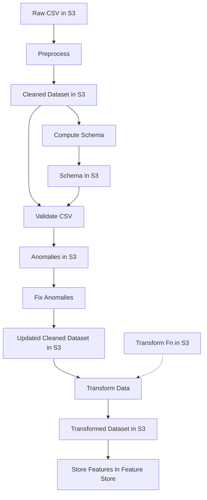
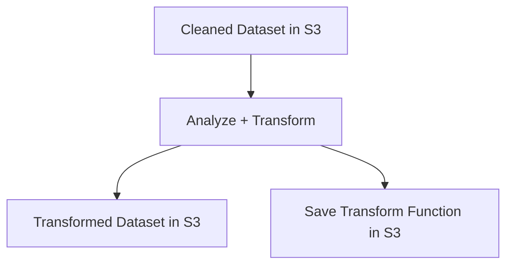
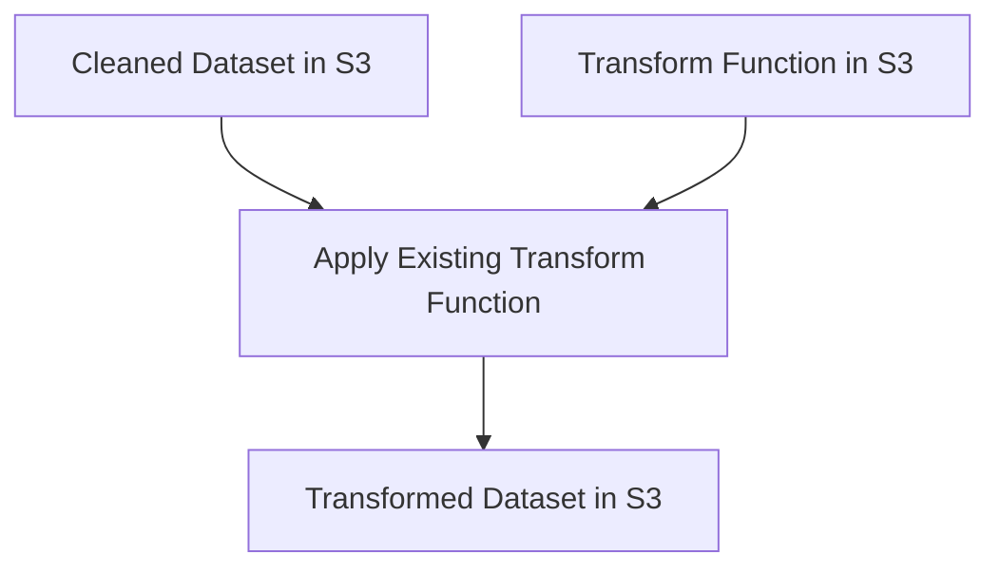

# 📊 SageMaker Feature Engineering & Validation Pipeline

This repository implements an **end-to-end feature engineering, validation, and feature storage pipeline** using **Amazon SageMaker Processing jobs**.  

It uses **Pandas** for preprocessing, **TensorFlow Data Validation (TFDV)** for schema generation and anomaly detection, and stores final features in **SageMaker Feature Store**.

---

## 📌 Pipeline Steps

### 1️⃣ Preprocess (`_preprocess`)
- Cleans raw CSV data.
- Saves cleaned dataset to:  
  `s3://<S3_BUCKET>/dataset/cleaned`

---

### 2️⃣ Compute Schema (`_compute_schema`)
- Uses **TFDV** to:
  - Generate a schema from cleaned data.
  - Compute data statistics.
- Saves schema to:  
  `s3://<S3_BUCKET>/schema`

---

### 3️⃣ Validate CSV (`_validate_csv`)
- Validates cleaned CSV data against the **generated schema**.
- Outputs anomalies to:  
  `s3://<S3_BUCKET>/anomalies`

---

### 4️⃣ Fix Anomalies (`_fix_anomalies`)
- Reads **schema**, **cleaned data**, and **anomaly reports**.
- Corrects invalid values and fixes detected anomalies.
- Updates:
  - `s3://<S3_BUCKET>/dataset/cleaned`
  - `s3://<S3_BUCKET>/anomalies`

---

### 5️⃣ Transform (`_transform`)
Two modes:
- **Analyze Mode (`analyze=True`)**
  - Runs TFDV analysis & transformation.
  - Saves transformed dataset and transformation function.
- **Inference Mode (`analyze=False`)**
  - Applies a previously saved transformation function to new data.

---

### 6️⃣ Store Features in Feature Store (`_store_features_in_feature_store`)
- Reads transformed dataset.
- Stores features in **Amazon SageMaker Feature Store**.

---

## 🔄 Pipeline Flow

### Overall Pipeline


## Transform Flow — Analyze Mode (analyze=True)


## Transform Flow — Inference Mode (analyze=False)


## Project structure
```
.
├── dataset/                                # Local dataset folder (raw/cleaned)
├── steps/
│   ├── preprocess.py                       # Data preprocessing
│   ├── compute_tfdv_schema.py               # Generate schema & stats
│   ├── tfdv_validate.py                     # Validate data
│   ├── fix_anomaly.py                       # Fix anomalies
│   ├── transform.py                         # Transform features
│   ├── store_features_in_feature_store.py   # Store features in Feature Store
├── helpers.py                               # Utility functions for SageMaker processors
├── pipeline.py                              # Main pipeline code
└── README.md
```

## 🚀 Running the Pipeline
```
python pipeline.py --step _preprocess
python pipeline.py --step _compute_schema
python pipeline.py --step _validate_csv
python pipeline.py --step _fix_anomalies
python pipeline.py --step _transform --analyze True
python pipeline.py --step _store_features_in_feature_store
```
