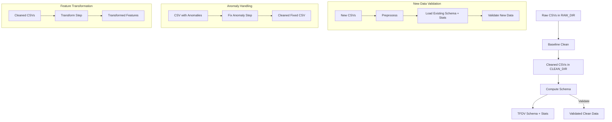

# 🛠 ZenML Data Processing Pipelines

This repository implements a **data validation and transformation workflow** using **ZenML pipelines** with **TensorFlow Data Validation (TFDV)** for schema generation and anomaly detection.

The pipelines handle:

- **Data Cleaning**
- **Schema Computation**
- **Validation of New Data**
- **Anomaly Fixing**
- **Feature Transformation**

---

## 📌 Pipelines Overview

### 1️⃣ Baseline Clean (`baseline_clean`)
- Reads **raw CSV files** from `RAW_DIR`.
- Preprocesses and cleans data.
- Outputs cleaned CSVs into `CLEAN_DIR`.

---

### 2️⃣ Compute Schema (`compute_schema`)
- Reads cleaned CSVs from `CLEAN_DIR`.
- Generates **TFDV schema** and **statistics**.
- Validates data against the generated schema.

---

### 3️⃣ Validate New CSV (`validate_new_csv`)
- Fetches **new incoming CSVs**.
- Cleans them using preprocessing step.
- Loads **existing schema** and **stats**.
- Validates new data for anomalies.

---

### 4️⃣ Fix Anomaly (`fix_anomaly`)
- Reads CSV files with anomalies.
- Applies fixes (e.g., correcting categories, handling missing values).
- Saves cleaned versions.

---

### 5️⃣ Transform (`transform`)
- Applies **feature engineering and transformations**.
- Can optionally run **analysis mode** before transformation.

---

## 🔄 Workflow Diagram


## Project structure
```
.
├── steps/
│   ├── preprocess.py           # Data cleaning and preprocessing
│   ├── compute_tfdv_schema.py  # Schema + stats computation
│   ├── tfdv_validate.py        # TFDV validation
│   ├── fix_anomaly.py          # Fixes detected anomalies
│   ├── transform.py            # Feature transformation logic
├── utils.py                    # Helper functions and constants
├── pipelines.py                # ZenML pipeline definitions
├── README.md                   # Documentation
```
## 🔄 Commands
```
`zenml pipeline run baseline_clean`
`zenml pipeline run compute_schema`
`zenml pipeline run validate_new_csv`
`zenml pipeline run fix_anomaly --csv_files data/anomalies/*.csv`
`zenml pipeline run transform --csv_files data/clean/*.csv --analyze true`
```
