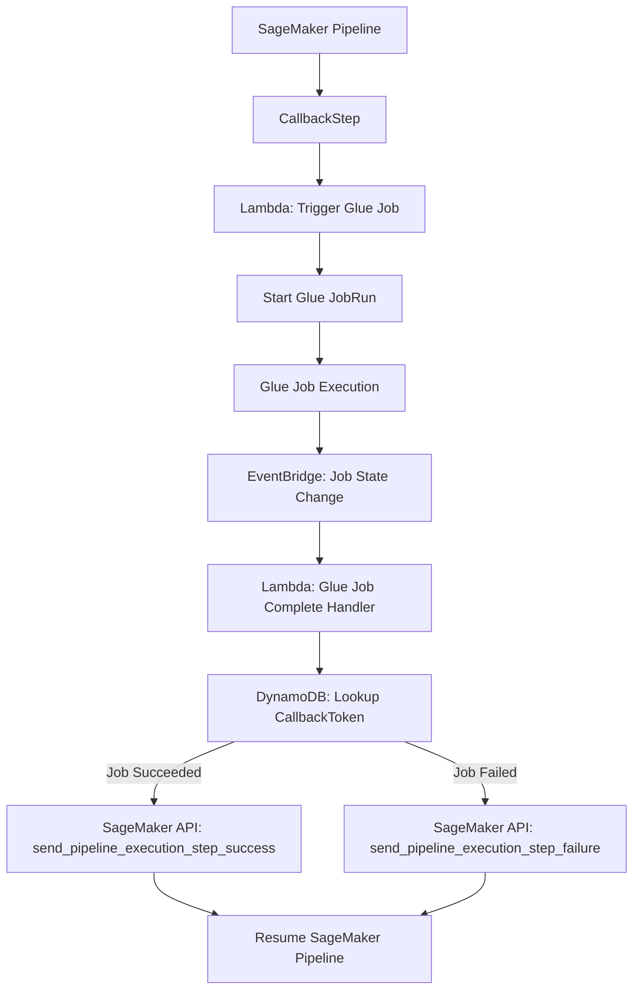

## Trigger glue job from sagemaker pipelines step



### 🔹 Step 1: SageMaker Pipeline Definition
```python
from sagemaker.workflow.callback_step import CallbackStep, CallbackOutput

# Define outputs we expect after Glue finishes
callback_step = CallbackStep(
    name="GlueJobCallback",
    callback_fn_name="trigger-glue-job",  # Lambda function name that starts Glue
    outputs=[
        CallbackOutput(output_name="JobRunId", output_type="String"),
        CallbackOutput(output_name="Status", output_type="String"),
    ],
)
```

### 🔹 Step 2: Lambda to Start Glue Job
```python
import boto3
import os

glue = boto3.client("glue")

def handler(event, context):
    job_name = os.environ["GLUE_JOB_NAME"]
    callback_token = event["Token"]  # Provided by SageMaker
    response = glue.start_job_run(JobName=job_name)

    job_run_id = response["JobRunId"]

    # Save job_run_id + callback_token somewhere (e.g., DynamoDB) for later lookup
    boto3.client("dynamodb").put_item(
        TableName=os.environ["TOKEN_TABLE"],
        Item={
            "JobRunId": {"S": job_run_id},
            "CallbackToken": {"S": callback_token},
        }
    )

    return {"JobRunId": job_run_id, "Token": callback_token}
```

### 🔹 Step 3: EventBridge Rule (Glue → Lambda)
```python
{
  "source": ["aws.glue"],
  "detail-type": ["Glue Job State Change"],
  "detail": {
    "jobName": ["my-glue-job"]
  }
}
```

### 🔹 Step 4: Lambda to Notify SageMaker
```python
import boto3
import os

sagemaker = boto3.client("sagemaker")
dynamodb = boto3.client("dynamodb")

def handler(event, context):
    job_run_id = event["detail"]["jobRunId"]
    state = event["detail"]["state"]

    # Lookup callback token
    record = dynamodb.get_item(
        TableName=os.environ["TOKEN_TABLE"],
        Key={"JobRunId": {"S": job_run_id}}
    )

    token = record["Item"]["CallbackToken"]["S"]

    if state == "SUCCEEDED":
        sagemaker.send_pipeline_execution_step_success(
            CallbackToken=token,
            OutputParameters=[
                {"Name": "JobRunId", "Value": job_run_id},
                {"Name": "Status", "Value": "SUCCEEDED"},
            ],
        )
    else:
        sagemaker.send_pipeline_execution_step_failure(
            CallbackToken=token,
            FailureReason=f"Glue job failed with state {state}",
        )
```
