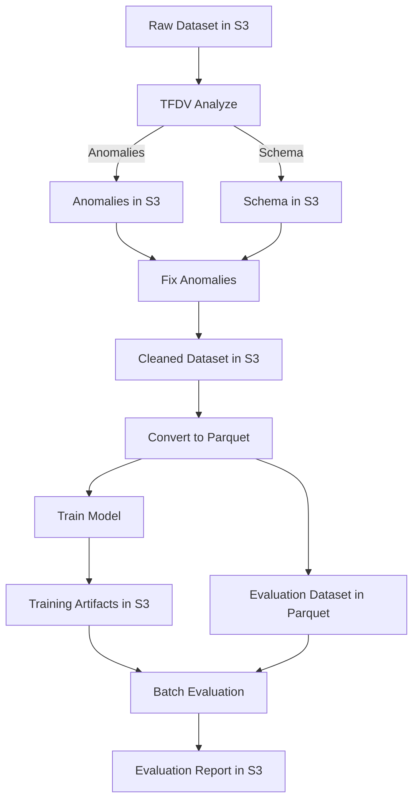

# SageMaker Feature Engineering, Validation & Training Pipeline

This repository implements an end-to-end machine learning pipeline using Amazon SageMaker Processing Jobs.  
It includes feature validation, anomaly fixing, data format conversion, model training, and batch evaluation.  

The pipeline leverages:  
- TensorFlow Data Validation (TFDV) for schema generation and anomaly detection  
- Pandas for data transformation, training, and evaluation  
- Amazon S3 for storing intermediate and final outputs  

---

## Pipeline Steps

### 1. TFDV Analyze (`_tfdv_analyze`)
- Runs TFDV to either:
  - Create schema from dataset (`create_schema=true`)
  - Validate dataset against an existing schema (`create_schema=false`)
- Saves:
  - Schema and statistics → `s3://<S3_BUCKET>/tfdv-outputs`
  - Anomalies → `s3://<S3_BUCKET>/anomalies`

### 2. Fix Anomalies (`_fix_anomalies`)
- Reads:
  - Cleaned dataset
  - Schema (`tfdv-outputs`)
  - Anomaly reports (`anomalies`)
- Corrects invalid values
- Outputs:
  - Updated dataset → `s3://<S3_BUCKET>/dataset/cleaned`
  - Updated anomalies report → `s3://<S3_BUCKET>/anomalies`

### 3. Convert to Parquet (`_convert_to_parquet`)
- Converts CSV data into Parquet format for efficient processing
- Saves to: `s3://<S3_BUCKET>/dataset/eval/parquet`

### 4. Train Model (`_train`)
- Trains model using parquet dataset
- Outputs training artifacts to: `s3://<S3_BUCKET>/artifacts`

### 5. Batch Evaluation (`_evaluate_batch`)
- Evaluates trained model against evaluation dataset
- Saves evaluation results to: `s3://<S3_BUCKET>/model-evaluation`

---

## Pipeline Flow

